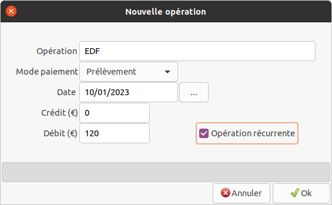

# RafCompta


## Présentation

Cette application permet de gérer de manière très simplifiée une comptabilité personnelle. Son but est d'enregistrer des opérations afin de connaitre son solde banque en temps réel, c'est à dire avant que les opérations figurent sur le compte en banque.
Dès que les opérations apparaissent sur le compte, il suffit d'effectuer le rapprochement bancaire des opérations dans l'application pour que celles ci soient tranférées dans les archives.

Elle est composée de 2 onglets: _Opérations, Paramètres_.
Les données sont stockées dans des fichiers au format _xml_.
Les fichiers sont stockés dans le sous-dossier _Fichiers_, situé dans le dossier de l’application.

## Principe de fonctionnement

### Créer un compte

Au 1er lancement de l'application, un message d'erreur signalera qu'aucun compte n'a été trouvé. La 1ère étape consiste donc à créer un ou plusieurs comptes.
Par le menu **Action** -> **Ajouter compte**, renseigner le nom du compte (16 caractères maxi) et son solde initial:


Sélectionner le compte dans la liste déroulante _Compte courant_ puis enregistrer les modifications par le menu **Fichier** -> **Enregistrer** ou par le bouton équivalent sous la barre de menus.

Plusieurs fichiers vont se créer:

* _ListeComptes.xml_: contient la listes des comptes créés (nom et solde initial).
* _NomCompte.xml_: contient les opérations enregistrées dans le compte nommé _NomCompte_.
* _Arch_NomCompte_aaaa.xml_: contient les opérations archivées pour le compte _NomCompte_ de l'année _aaaa_ (_aaaa_ correspond à l'année en cours au moment de la création du compte).

### Saisir des opérations

Saisir ensuite des opérations par le menu **Actions** -> **Ajouter opération** ou par le bouton équivalent dans la fenêtre principale.



### Effectuer le rapprochement bancaire


Lorsque les opérations sont visibles sur le compte en banque, on peut effectuer le rapprochement bancaire.

* Saisir le nouveau solde banque dans la zone de texte _Banque_.
* Cocher la case en début de chaque ligne à rapprocher. L'écart avec la banque apparait dans la zone de texte _Ecart_.
Si l'écart est de 0, un rapprochement devient possible, et un bouton **Rapprocher** apparait.
  
    ```text
    Ecart = SoldeInitial + TotalCréditSélection - TotalDébitSélection - SoldeBanque
    ```

* Cliquer sur le bouton **Rapprocher**, les lignes disparaissent et le solde initial est mis à jour dans l'onglet _Paramètres_ du compte.
Si _Archiver les lignes rapprochées_ est coché dans l'onglet _Paramètres_, les lignes sont archivées.
* Enregistrer les modifications par le menu **Fichier** -> **Enregistrer** ou par le bouton équivalent sous la barre de menus.
Les fichiers déjà créés sont mis à jour.
Si parmi les opérations archivées, une au moins n'a pas été effectuée pendant l'année courante, un nouveau fichier d'archives est créé pour l'année concernée.

## Paramètres du compte courant


On peut modifier à tout moment le solde initial du compte.

Les paramètres globaux concernent l'application:

* _Charger le fichier après sélection du compte_: toujours coché.
Le fichier de compte se charge automatiquement lorsqu'on sélectionne un compte dans la liste déroulante _Compte courant_.
* _Sauvegarder le fichier de comptes à la fermeture_: si coché, les fichiers sont sauvegardés automatiquement à la fermeture de l'application.
* _Archiver les lignes rapprochées_: si coché, les lignes sont archivées lors du rapprochement bancaire.

Certains de ces paramètres sont prédéfinis dans le fichier de configuration de l'application _app.config_. Ils sont mis à jour à la fermeture de l'application. Le nom par défaut du fichier de données des comptes _ListeComptes.xml_ n'est pas modifiable dans l'application, mais directement dans le fichier de configuration.

```text
<appSettings>
<add key="FichierDonneesComptes" value="ListeComptes.xml" />
<add key="SauveFichierAuto" value="true" />
<add key="ArchiveLigneRappro" value="true" />
</appSettings>
```

## Consulter les archives

Par le menu **Ficher** -> **Consulter archive** ou en cliquant sur le bouton équivalent on peut consulter les archives du compte courant. Une fenêtre affiche d'abord les fichiers disponibles (1 fichier par année):


Sélectionner le fichier à consulter, faire double-clic sur la ligne ou cliquer sur _OK_. La fenêtre affichant les opérations archivées s'ouvre:


Des zones de filtre sont disponibles dans la partie haute de la fenêtre.

## Développement et installation

L’application est développée en C# avec _Visual Studio Code_ sur PC Ubuntu, elle utilise les frameworks _.NET 6_ et _Gtk3_ via la librairie [GtkSharp](https://github.com/GtkSharp/GtkSharp).

_Gtk3_ est installé par défaut sur les systèmes Linux Ubuntu et Xubuntu.
Pour utilisation sur système Windows, il faut installer _Gtk3_.

La publication de l’application dans _Visual Studio Code_ peut se faire de 2 manières:

1. version autonome intégrant le _Runtime .NET 6_</br>
Linux: ```dotnet publish -c Release -r linux-x64 --self-contained true```</br>
Windows: ```dotnet publish -c Release -r win-x64 --self-contained true```
2. version minimale nécessitant l’installation du _Runtime .NET 6_ sur le PC de destination</br>
Linux: ```dotnet publish -c Release -r linux-x64 --self-contained false```</br>
Windows: ```dotnet publish -c Release -r win-x64 --self-contained false```</br>

Pour déployer l'application en dehors de _Visual Studio Code_:

* récupérer le dossier _publish_ (situé dans le dossier _/bin/Release/net6.0/_ du projet) et le renommer en _RafCompta_ (ou autre nom à votre convenance).
* facultatif: copier le dossier _Fichiers_ contenant des exemples de comptes, dans le dossier _RafCompta_.
* après copie du dossier _RafCompta_ sur le support de destination, donner les droits d'exécution au fichier _RafCompta_.
* créer un lanceur comprenant en exécutable le fichier _RafCompta_.
* l'icône de l'application (_comptabilite.png_) est disponible dans le dossier _images_.

## Notes de version

* **1.3.0113.1**
    Première version publiée.

## Téléchargements

* Archive _tar.xz_ sans le Runtime _.NET 6_: [v1.3.0113.1](https://e-nautia.com/rafbor/disk/RafCompta/RafCompta_1.3.0113.1_sans_runtime.tar.xz)
* Archive _tar.xz_ incluant le Runtime _.NET 6_: [v1.3.0113.1](https://e-nautia.com/rafbor/disk/RafCompta/RafCompta_1.3.0113.1_avec_runtime.tar.xz)
