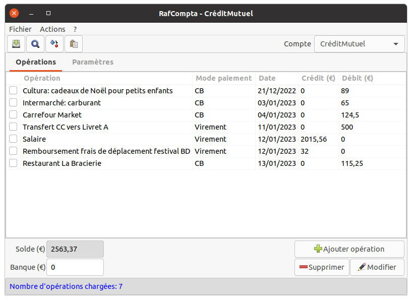
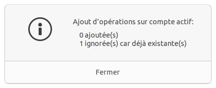
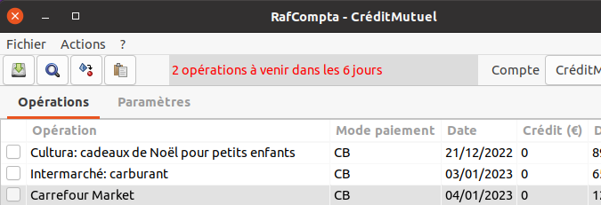
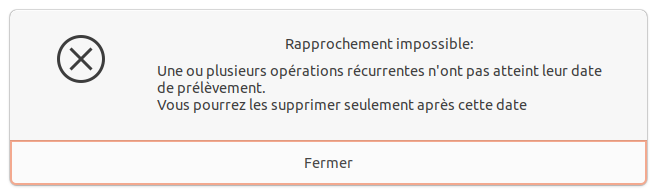
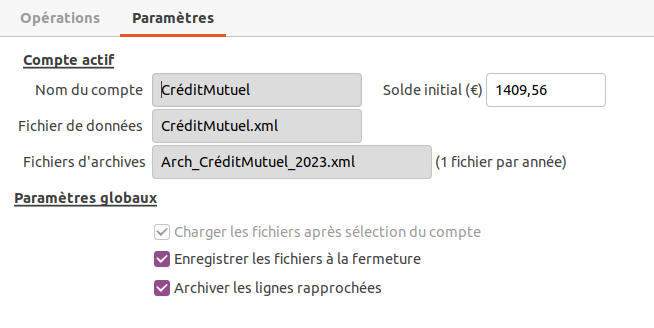

- [RafCompta](#rafcompta)
  - [Présentation](#présentation)
  - [Principe de fonctionnement](#principe-de-fonctionnement)
    - [Créer un compte](#créer-un-compte)
    - [Saisir des opérations](#saisir-des-opérations)
    - [Modifier ou supprimer des opérations](#modifier-ou-supprimer-des-opérations)
    - [Opérations récurrentes](#opérations-récurrentes)
    - [Gestion des opérations à venir](#gestion-des-opérations-à-venir)
    - [Effectuer le rapprochement bancaire](#effectuer-le-rapprochement-bancaire)
    - [Transfert entre comptes](#transfert-entre-comptes)
  - [Paramètres du compte actif](#paramètres-du-compte-actif)
  - [Consulter les archives](#consulter-les-archives)
  - [Développement et installation](#développement-et-installation)
  - [Notes de version](#notes-de-version)
  - [Téléchargements](#téléchargements)
    - [Installation sur Linux](#installation-sur-linux)

# RafCompta



## Présentation

Cette application permet de gérer de manière très simplifiée une comptabilité personnelle. Son but est d'enregistrer des opérations afin de connaitre son solde banque en temps réel, c'est à dire avant que les opérations figurent sur le compte en banque.
Dès que les opérations apparaissent sur le compte, il suffit d'effectuer le rapprochement bancaire des opérations dans l'application pour que celles ci soient tranférées dans les archives.

Elle est composée de 2 onglets: _Opérations, Paramètres_.
Les données sont stockées dans des fichiers au format _xml_.
Les fichiers sont stockés dans le dossier utilisateur, dans un dossier caché _.rafcompta_.

## Principe de fonctionnement

### Créer un compte

Au 1er lancement de l'application, si aucun compte n'a été trouvé, il vous est proposé de créer un compte.
La boite de dialogue _Nouveau compte_ s'ouvre (aussi accessible par le menu **Action** -> **Ajouter compte**), renseigner le nom du compte (16 caractères maxi) et son solde initial:


Sélectionner le compte dans la liste déroulante _Compte courant_ puis enregistrer les modifications par le menu **Fichier** -> **Enregistrer** ou par le bouton équivalent sous la barre de menus.

Plusieurs fichiers vont se créer:

- _ListeComptes.xml_: contient la listes des comptes créés (nom et solde initial).
- _NomCompte.xml_: contient les opérations enregistrées dans le compte nommé _NomCompte_.
- _Arch_NomCompte_aaaa.xml_: contient les opérations archivées pour le compte _NomCompte_ de l'année _aaaa_ (_aaaa_ correspond à l'année en cours au moment de la création du compte).

### Saisir des opérations

Saisir ensuite des opérations par le menu **Actions** -> **Ajouter opération** ou par le bouton équivalent dans la fenêtre principale.
Cocher la case _Opération récurrente_ si on veut pouvoir l'ajouter les mois suivants sans la saisir à nouveau.


### Modifier ou supprimer des opérations

Ces opérations se font ligne par ligne. Sélectionner toute la ligne (la coche n'est pas prise en compte) puis choisir l'action désirée par les menus **Actions** -> **Modifier opération** ou **Actions** -> **Supprimer opération** ou par les boutons équivalents dans la fenêtre principale.
Pour les opérations récurrentes, la suppression de la coche _Opération récurrente_ n'est plus possible.
La date n'est pas modifiable non plus afin de ne pas perturber l'algorythme de recherche d'opérations à venir.
Si nécessaire, supprimer puis recréer les opérations.

### Opérations récurrentes

Par le menu **Actions** -> **Opérations récurrentes** ou par le bouton équivalent dans la fenêtre principale, on accède à la fenêtre de gestion:


Cocher les lignes d'opérations à ajouter au compte actif, le bouton _Ajouter au compte_ apparait. La date d'ajout sera fixée au jour indiqué, pour le mois courant.
On peut supprimer ou modifier une opération en sélectionnant la ligne. La modification comporte les mêmes contraintes que celles décrites au §[Modifier ou supprimer des opérations](#modifier-ou-supprimer-des-opérations)

Chaque opération est identifiée par une clé unique, si l'opération existe déjà dans le compte actif, elle sera ignorée:



### Gestion des opérations à venir

L'application vérifie si des opérations sont à venir dans les 6 jours qui suivent la date courante. Une alerte s'affiche dans la barre des boutons.



Vous devez insérer les opérations comme décrit au §[Opérations récurrentes](#opérations-récurrentes).

### Effectuer le rapprochement bancaire


Lorsque les opérations sont visibles sur le compte en banque, on peut effectuer le rapprochement bancaire.

- Saisir le nouveau solde banque dans la zone de texte _Banque_.
- Cocher la case en début de chaque ligne à rapprocher. Le total des débits et crédits ainsi que l'écart avec la banque apparaissent.
Si l'écart est de 0, un rapprochement devient possible, et un bouton **Rapprocher** apparait.
  
    ```text
    Ecart = SoldeInitial + TotalCréditSélection - TotalDébitSélection - SoldeBanque
    ```

- Cliquer sur le bouton **Rapprocher**, les lignes disparaissent et le solde initial est mis à jour dans l'onglet _Paramètres_ du compte.
Si _Archiver les lignes rapprochées_ est coché dans l'onglet _Paramètres_, les lignes sont archivées.
- Enregistrer les modifications par le menu **Fichier** -> **Enregistrer** ou par le bouton équivalent sous la barre de menus.
Les fichiers déjà créés sont mis à jour.
Si parmi les opérations archivées, une au moins n'a pas été effectuée pendant l'année courante, un nouveau fichier d'archives est créé pour l'année concernée.

:warning: les opérations récurrentes ne peuvent pas être rapprochées tant que leur date d'échéance n'est pas révolue, ceci afin de ne pas perturber l'algorythme de recherche d'opérations à venir.
Le message suivant apparait dans ce cas:



### Transfert entre comptes

Par le menu **Actions** -> **Transfert entre comptes** ou par le bouton équivalent dans la fenêtre principale, on accède à la fenêtre de transfert:


Renseigner le compte destinataire, un libellé d'opération et le montant. Le compte à débiter est toujours le compte actif. Le compte destinataire ne peut pas être le compte actif.
Après validation, l'opération est enregistrée en tant que virement au débit sur le compte courant et au crédit sur le compte destinataire, à la date courante.

## Paramètres du compte actif



On peut modifier à tout moment le solde initial du compte.

Les paramètres globaux concernent l'application:

- _Charger les fichiers après sélection du compte_: toujours coché.
Les fichiers de comptes sont chargés automatiquement lorsqu'on sélectionne un compte dans la liste déroulante _Compte_.
- _Enregistrer les fichiers à la fermeture_: si coché, les fichiers sont sauvegardés automatiquement à la fermeture de l'application.
- _Archiver les lignes rapprochées_: si coché, les lignes sont archivées lors du rapprochement bancaire.

Certains de ces paramètres sont prédéfinis dans le fichier de configuration de l'application _app.config_ qui est stocké dans le dossier caché _.rafcompta_ du dossier utilisateur. Ils sont mis à jour à la fermeture de l'application. Le nom par défaut du fichier de données des comptes _ListeComptes.xml_ n'est pas modifiable dans l'application, mais directement dans le fichier de configuration.
Idem pour la clé des opérations récurrentes _KeyOpeRecur_  et le nom du dernier compte utilisé _DernierCompteActif_ qui sont gérés par l'application et **ne doivent pas être modifiés**.

```text
<userSettings>
  <FichierDonneesComptes value="ListeComptes.xml" />
  <SauveFichierAuto value="True" />
  <ArchiveLigneRappro value="True" />
  <KeyOpeRecur value="0" />
  <DernierCompteActif value="CréditMutuel" />
</userSettings>
```

## Consulter les archives

Par le menu **Ficher** -> **Consulter archive** ou en cliquant sur le bouton équivalent on peut consulter les archives du compte actif. Une fenêtre affiche d'abord les fichiers disponibles (1 fichier par année):


Sélectionner le fichier à consulter, faire double-clic sur la ligne ou cliquer sur _OK_. La fenêtre affichant les opérations archivées s'ouvre:


Des zones de filtre sont disponibles dans la partie haute de la fenêtre.

## Développement et installation

L’application est développée en C# avec _Visual Studio Code_ sur PC Ubuntu, elle utilise les frameworks _.NET 6_ et _Gtk3_ via la librairie [GtkSharp](https://github.com/GtkSharp/GtkSharp).

_Gtk3_ est installé par défaut sur les systèmes Linux Ubuntu et Xubuntu.
Pour utilisation sur système Windows, il faut installer _Gtk3_.

La publication de l’application dans _Visual Studio Code_ peut se faire de 2 manières:

1. version autonome intégrant le _Runtime .NET 6_</br>
Linux: ```dotnet publish -c Release -r linux-x64 --self-contained true```</br>
Windows: ```dotnet publish -c Release -r win-x64 --self-contained true```
2. version minimale nécessitant l’installation du _Runtime .NET 6_ sur le PC de destination</br>
Linux: ```dotnet publish -c Release -r linux-x64 --self-contained false```</br>
Windows: ```dotnet publish -c Release -r win-x64 --self-contained false```</br>

Pour déployer l'application en dehors de _Visual Studio Code_:

- récupérer le dossier _publish_ (situé dans le dossier _/bin/Release/net6.0/_ du projet) et le renommer en _RafCompta_ (ou autre nom à votre convenance).
- après copie du dossier _RafCompta_ sur le support de destination, donner les droits d'exécution au fichier _RafCompta_.
- créer un lanceur comprenant en exécutable le fichier _RafCompta_.
- l'icône de l'application (_comptabilite.png_) est disponible dans le dossier _images_.

## Notes de version

- **2.0.0303.0**
  - Bugfix lors du rapprochement d'opérations récurrentes saisies le mois précédent.
  - Publication sous forme d'AppImage. 
- **2.0.0206.1**
  - Ajout alertes sur les opérations à venir.
  - Les données et la config utilisateur ne sont plus stockées dans le dossier de l'application mais dans le dossier utilisateur afin de faciliter l'installation des nouvelles versions.
- **1.4.0203.1**
  - Suppression des demandes d'enregistrement lors du changement de compte ou de la consultation des archives, si la sauvegarde auto est activée.
  - Les opérations de transfert ne sont plus enregistrées directement dans le compte destinataire mais stockées dans un DataTable.
  - Ajout nom du compte dans le titre de la fenêtre.
- **1.4.0130.0**
  - Bugfix sur l'insertion d'opération récurrente, quand la date du jour est supérieure au nombre de jours du mois courant.
  - A l'ouverture, on charge le dernier compte utilisé.
  - Changé libellés dans les labels et les messages: _compte courant_ devient _compte actif_.
  - Ajout gestion de transfert entre comptes.
- **1.4.0125.0**
  - Bugfix sur sauvegarde de la configuration.
  - Ajout affichage des totaux débits et crédits des lignes sélectionnées.
  - Ajout gestion des opérations récurrentes.
  - Corrections mineures.
- **1.3.0116.0**
  - Ajout contrôle sur saisie simultanée de débit et de crédit et prise en compte de la valeur absolue des valeurs.
  - Suppression du menu **Fichier**->**Ouvrir** et du bouton associé (le chargement des données comptes est automatique).
  - Au lancement de l'application, si aucun compte n'existe, on enchaîne sur la création d'un compte.
- **1.3.0113.1**
    Première version publiée.

## Téléchargements

- **Linux**: 
  - fichier AppImage: voir [Releases](https://github.com/Rafbor42/RafCompta/releases).
  - archive _tar.xz_ incluant le Runtime _.NET 6_: [v2.0.0303.0](https://e-nautia.com/rafbor/disk/RafCompta/RafCompta_2.0.0303.0_avec_runtime.tar.xz)

### Installation sur Linux

 - fichier AppImage: consulter cette [documentation](https://doc.ubuntu-fr.org/appimage) pour savoir comment installer des fichiers AppImage.
 - archive _tar.xz_: 
    - décompresser l'archive et se positionner dans le dossier.
    - rendre exécutable le fichier _RafCompta_: ```chmod +x RafCompta```
    - lancer l'application: ```./RafCompta```